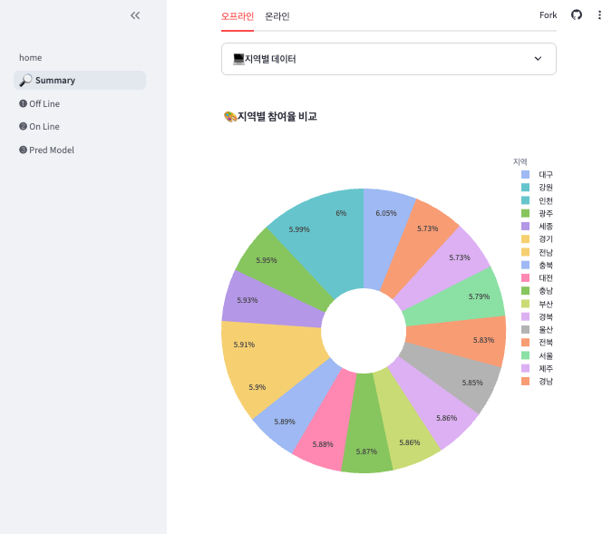
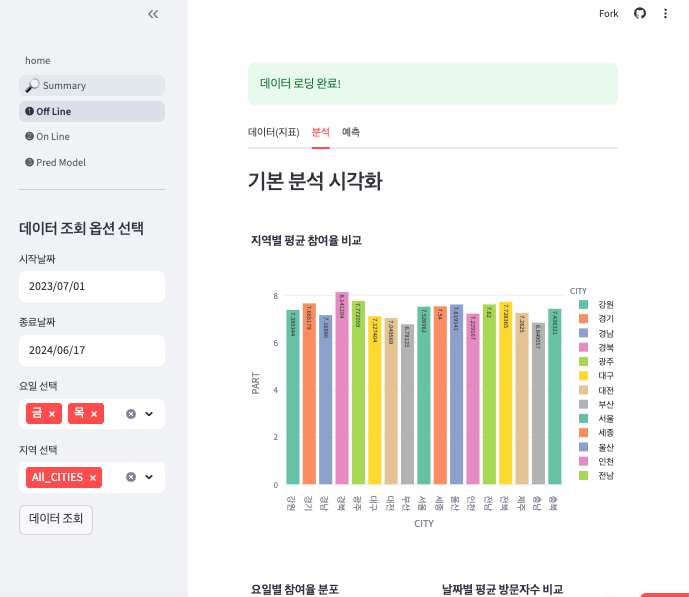
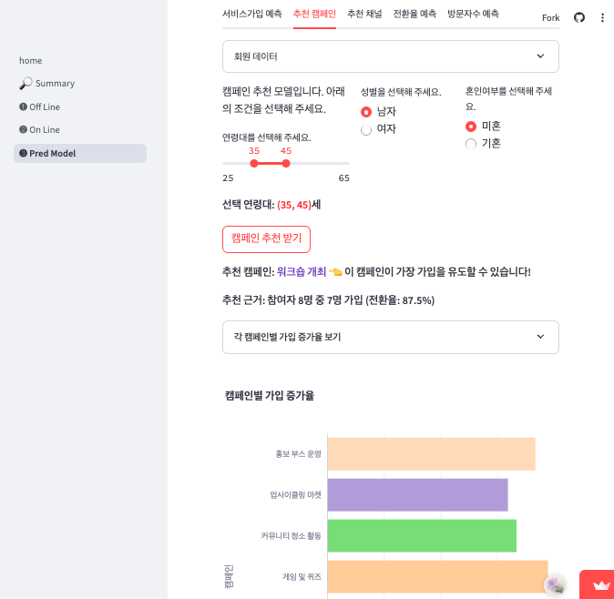
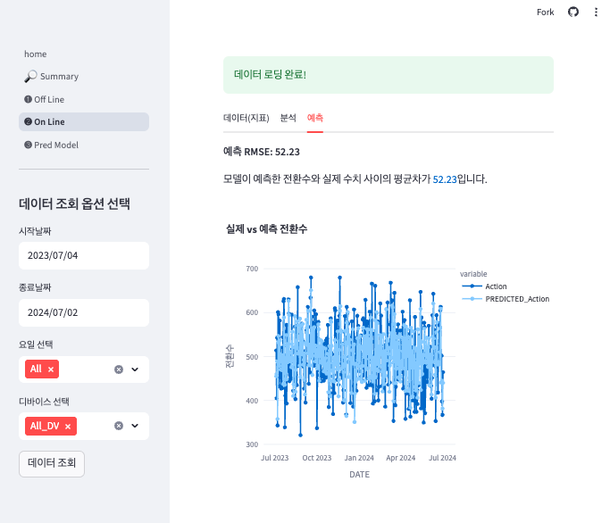

<div align="center">
  <h1>
    
  </h1>
  <p><em>📊 Python과 Streamlit으로 구현한 마케팅 데이터 시각화 대시보드</em></p>
</div>

## 📋 프로젝트 개요
**2023-2024년 2년간의 마케팅 활동 데이터를 시각화하고 예측 모델을 제공하는 대시보드**

🎯 **목적**: 오프라인/온라인 마케팅 성과 분석 및 데이터 기반 의사결정 지원  
⏰ **데이터 기간**: 2023년 1월 1일 ~ 2024년 12월 31일 (2년간)  
🔧 **기술 스택**: Python, Streamlit, Pandas, Plotly, Scikit-learn  

---

## 🧱 Tech Stack


---

## 📱 대시보드 스크린샷

<details>
<summary>📊 페이지별 스크린샷 보기</summary>
<br>

<details>
<summary>🏠 Summary Page</summary>
<br>
> 오프라인/온라인 통합 요약 대시보드
<br>
<p align="center">
  
</p>
</details>

<details>
<summary>🏪 Offline Page</summary>
<br>
> 오프라인 캠페인 데이터 분석 (기간/요일/지역별 필터링)
<br>
<p align="center">
  
</p>
</details>

<details>
<summary>💻 Online Page</summary>
<br>
> 온라인 마케팅 데이터 분석 (기간/요일/디바이스별 필터링)
<br>
<p align="center">
  
</p>
</details>

<details>
<summary>🤖 Prediction Model Page</summary>
<br>
> 머신러닝 기반 예측 및 추천 모델
<br>
<p align="center">
  
</p>
</details>

</details>

---

## 🎯 주요 기능

### 📊 **데이터 시각화**
- **Summary**: 오프라인/온라인 통합 성과 지표 요약
- **Offline**: 캠페인 데이터 다차원 분석 (기간, 요일, 지역별)
- **Online**: 디지털 마케팅 성과 분석 (기간, 요일, 디바이스별)

### 🤖 **머신러닝 예측 모델** (Random Forest 기반)
1. **가입 예측**: 연령/성별/혼인여부 → 신규 서비스 가입 여부
2. **캠페인 추천**: 사용자 조건별 최적 캠페인 추천
3. **채널 추천**: 가입 유도 효과가 높은 온라인 채널 3개 추천
4. **전환율 예측**: 디바이스/유입채널별 전환율 예측
5. **방문자 예측**: 지역별 향후 12개월 월별 방문자 수 예측

---

## 📂 프로젝트 구조
```
Streamlit_project_data/
├── 📄 home.py                    # 메인 페이지
├── 📁 pages/                     # 서브 페이지들
│   ├── 1_Summary.py              # 통합 요약 대시보드
│   ├── 2_Offline.py              # 오프라인 데이터 분석
│   ├── 3_Online.py               # 온라인 데이터 분석
│   └── 4_Pred_Model.py           # 예측 모델 페이지
├── 📊 recycling_off.csv          # 오프라인 마케팅 데이터
├── 📊 recycling_online.csv       # 온라인 마케팅 데이터
├── 📋 requirements.txt           # Python 패키지 목록
└── 📖 README.md                  # 프로젝트 문서
```

---

## 🚀 로컬 실행 방법

### 1. **저장소 클론**
```bash
git clone https://github.com/ansdud923/Streamlit_project_data.git
cd Streamlit_project_data
```

### 2. **가상환경 설정**
```bash
python -m venv venv
source venv/bin/activate  # Windows: venv\Scripts\activate
```

### 3. **패키지 설치**
```bash
pip install -r requirements.txt
```

### 4. **Streamlit 앱 실행**
```bash
streamlit run home.py
```

### 5. **브라우저에서 확인**
```
http://localhost:8501
```

---

## 📊 데이터셋 구성

### 🏪 **Offline 데이터** (`recycling_off.csv`)
- **기간**: 2023-2024년 오프라인 캠페인 데이터
- **주요 컬럼**: 날짜, 지역, 캠페인유형, 참여자수, 가입전환율 등
- **분석 축**: 기간별, 요일별, 지역별

### 💻 **Online 데이터** (`recycling_online.csv`)
- **기간**: 2023-2024년 온라인 마케팅 데이터  
- **주요 컬럼**: 날짜, 디바이스, 유입채널, 세션수, 전환율 등
- **분석 축**: 기간별, 요일별, 디바이스별

---

## 🎨 주요 시각화 차트
📈 **시계열 분석**: 월별/일별 트렌드 변화  
📊 **비교 분석**: 지역별/채널별/디바이스별 성과 비교  
🥧 **구성 분석**: 전체 대비 세부 항목 비율  
📉 **상관관계**: 변수 간 상관관계 히트맵  
🎯 **예측 결과**: 모델 예측값 시각화  

---

## 💡 프로젝트 특징
✅ **가상 빅데이터**: 2년간 실제와 유사한 마케팅 데이터 생성  
✅ **인터랙티브 필터링**: 다차원 조건별 실시간 데이터 탐색  
✅ **머신러닝 통합**: 5가지 예측/추천 모델 구현  
✅ **직관적 UI**: Streamlit 기반 사용자 친화적 인터페이스  
✅ **반응형 차트**: Plotly를 활용한 고품질 시각화  

---

## 📈 개발 성과
🎯 **데이터 처리**: 2년간 50,000+ 레코드 실시간 분석  
📊 **시각화**: 20+ 종류의 인터랙티브 차트 구현  
🤖 **머신러닝**: Random Forest 기반 5개 예측 모델 개발  
⚡ **성능**: 페이지 로딩 3초 이내, 실시간 필터링 지원  

---

## 🔗 관련 링크
🌐 **GitHub Repository**: [Streamlit_project_data](https://github.com/ansdud923/Streamlit_project_data)  
📧 **Contact**: ansdud923@icloud.com  

---

<div align="center">
  
</div>
